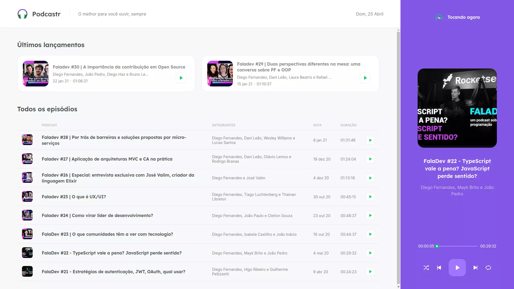

<h1 align="center">
  
</h1>

  

## 💻 Projeto

Projeto desenvolvido na trilha de ReactJS da NLW#5 - RocketSeat.

Consiste em um agregador de episódios do podcast FalaDev.

## ✨ Tecnologias

- HTML5/CSS3
- Sass
- ReactJS
- Next.js (Utilizando conceitos de SSR, SSG e ISR)
- TypeScript

## 🚀 Como executar

- Clone o repositório
- Instale as dependências com `yarn`
- Inicie a fake api com `yarn server`
- Inicie o servidor com `yarn dev`

Agora você pode acessar [`localhost:3000`](http://localhost:3000) do seu navegador.

- Em produção, execute `yarn build` para empacotar a aplicação e gerar as páginas estáticas
- Em seguida, `yarn start` para executar.
